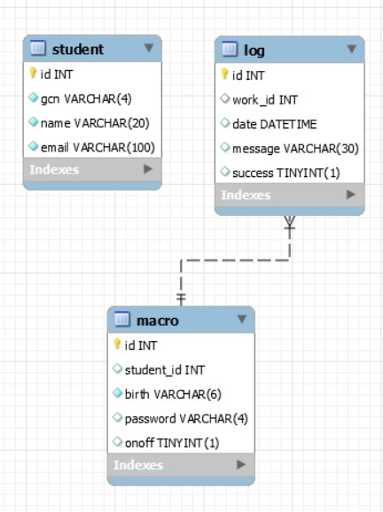

1. [자가진단 매크로 서비스란](#자가진단-매크로-서비스란)
2. [자가진단 매크로에서 만날 수 있는 장점](#자가진단-매크로에서-만날-수-있는-장점)
3. [유스케이스 다이어그램](#유스케이스-다이어그램)
4. [ER 다이어그램](#er-다이어그램)

# 자가진단 매크로 서비스란
반복적으로 수행하는 자가진단의 불편함을 덜기위해 대규모의 클라이언트를 대상으로 다량의 
자가진단 매크로를 수행 및 상태 관리를 할 수 있는 서비스입니다.

# 자가진단 매크로에서 만날 수 있는 장점
사용자 친화적인 UI로 핵심 기능만을 다룬 심플한 서비스를 제공합니다. 또한 본 서비스는 DSM Auth로 부터 사용자 정보를 이용합니다.
자기진단 매크로에서 제공하는 서비스는 아래와 같습니다.
- 매주 평일마다 아침 7시에 자가진단을 수행하는 매크로 서버
- 매크로 서버의 동작 상태 확인
- 매크로 서버 on/off 동작 제어

# 유스케이스 다이어그램

# ER 다이어그램
